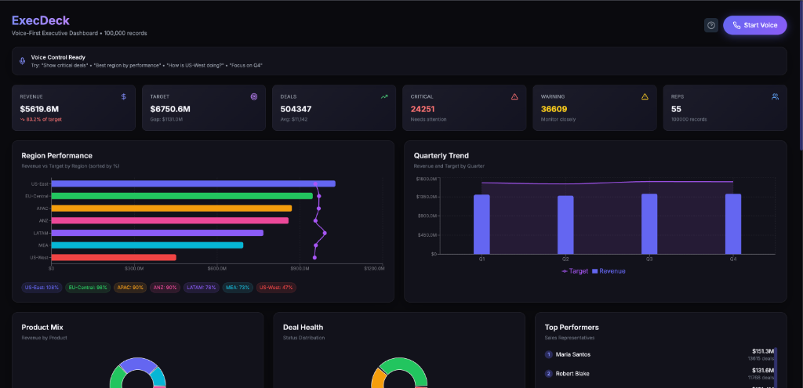

# ExecDeck 🎙️

**Voice-First Executive Dashboard** — Navigate $5.6B in sales data using natural voice commands.

Built with [Vocal Bridge](https://vocalbridgeai.com) for the Voice AI Hackathon 2026.



## ✨ Features

- **Voice Control** — Ask questions like "Show critical deals" or "Why is US-West underperforming?"
- **Real-time Transcription** — See what you said and what the agent responds
- **Smart Filtering** — Filter by region, product, quarter, status, rep, or close month
- **Undo Support** — "Go back" reverts to the previous filter state
- **Comparison View** — "Compare US-East and US-West" shows side-by-side analytics
- **100k Records** — Handles large datasets with loading states and pagination

## 🚀 Quick Start

```bash
# Install dependencies
npm install

# Set up environment
cp .env.local.example .env.local
# Add your VOCAL_BRIDGE_API_KEY

# Start dev server
npm run dev
```

Open [http://localhost:3000](http://localhost:3000) and click **Start Voice**.

## 🎤 Voice Commands

| Category | Example Commands |
|----------|------------------|
| **Filter** | "Show critical deals", "Focus on US-West", "Q4 results" |
| **Analyze** | "Best region?", "Why is LATAM red?", "Top sales rep" |
| **Compare** | "Compare US-East and US-West", "Q3 vs Q4" |
| **Time** | "Deals closing in January" |
| **Navigate** | "Show everything", "Go back", "Zoom into Sarah Chen" |

## 🛠️ Tech Stack

- **Next.js 15** — React framework with Turbopack
- **LiveKit** — Real-time voice communication
- **Vocal Bridge** — Voice AI agent platform
- **Recharts** — Data visualization
- **Tailwind CSS** — Styling

## 📁 Project Structure

```
src/
├── app/
│   ├── page.tsx          # Main dashboard page
│   ├── globals.css       # Global styles
│   └── api/voice-token/  # LiveKit token endpoint
├── components/
│   ├── Dashboard.tsx     # Charts and data table
│   ├── VoiceControl.tsx  # Mic controls
│   └── ComparisonView.tsx# Side-by-side comparison modal
├── hooks/
│   └── useVoiceAgent.ts  # LiveKit connection hook
└── data/
    └── sales_data.json   # Sample sales data (100k records)
```

## 🔧 Environment Variables

```env
VOCAL_BRIDGE_API_KEY=your_api_key_here
```

## 📊 Agent Configuration

In your Vocal Bridge dashboard, configure these **Client Actions**:

| Action | Direction | Description |
|--------|-----------|-------------|
| `set_filter` | Agent → App | Apply filters to dashboard |
| `clear_filters` | Agent → App | Reset all filters |
| `compare` | Agent → App | Open comparison view |
| `undo` | Agent → App | Revert to previous state |
| `data_context` | App → Agent | Send current data context |

## 🏗️ Build for Production

```bash
npm run build
npm start
```

## 📄 License

MIT

---

**Built for the Voice AI Hackathon 2026** 🏆
